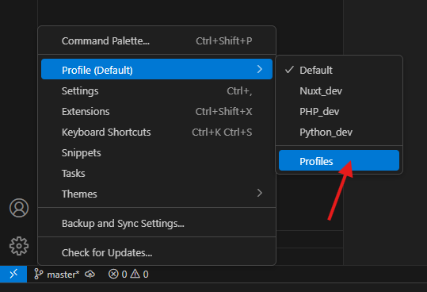
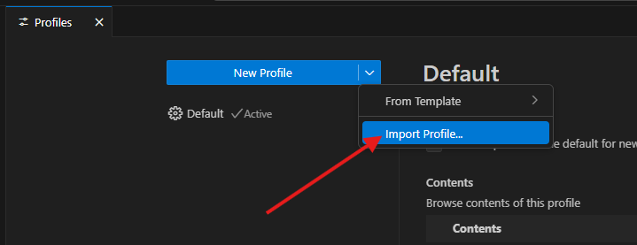
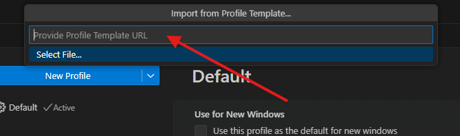
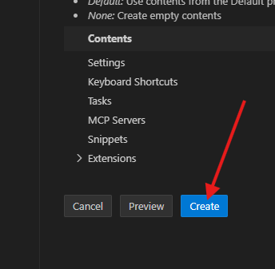
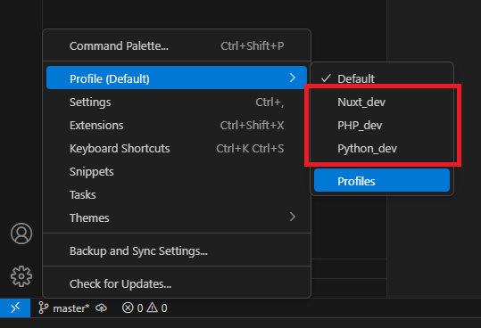

# VsCode-Profiles

This is where I save my VsCode profiles

| Profiles | Filename                                                               |
| -------- | ---------------------------------------------------------------------- |
| Python   | [Python_dev.code-profile](./profiles/Python_dev.code-profile?raw=true) |
| Nuxt     | [Nuxt_dev.code-profile](./profiles/Nuxt_dev.code-profile?raw=true)     |
| PHP      | [PHP_dev.code-profile](./profiles/PHP_dev.code-profile?raw=true)       |
| Docs     | [Docs.code-profile](./profiles/Docs.code-profile?raw=true)             |

## Tutorial

Click on `Profiles` on the bottom left menu.

On the `New Profile` dropdown click on `Import Profile...`.

Then paste the `raw` link for the profile from this repo and press `Enter` or download the `<profile_name>.code-profile` and select it.

And click on `Create`.

Done!

## Select profile

You can choose the profile you want to use on the bottom left menu.

